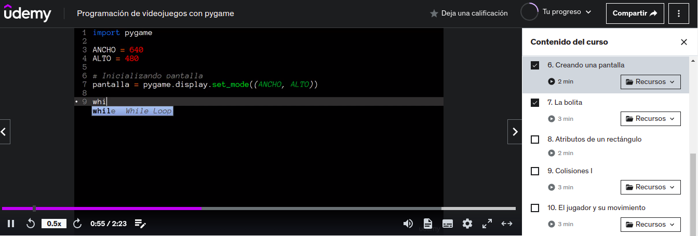
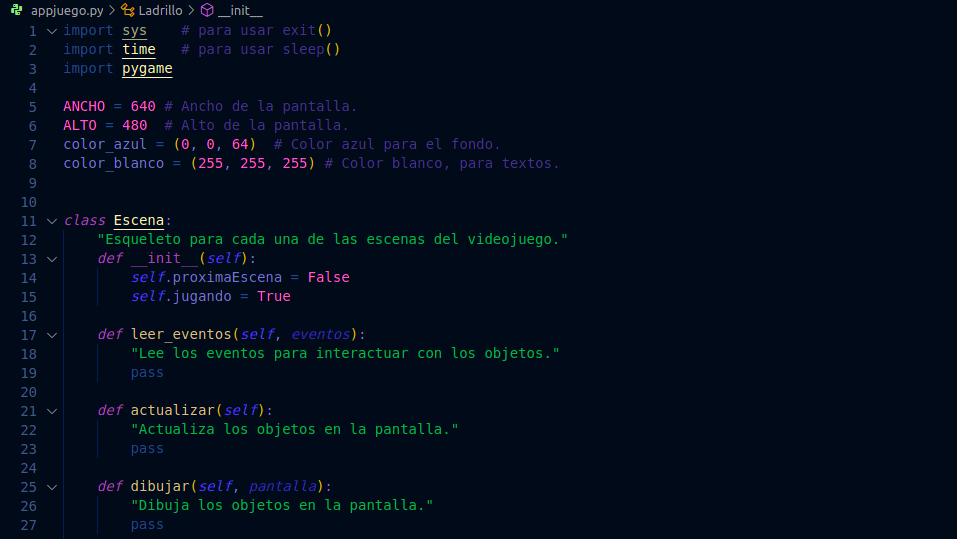
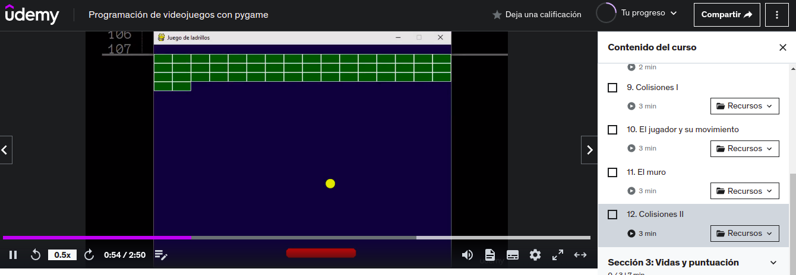
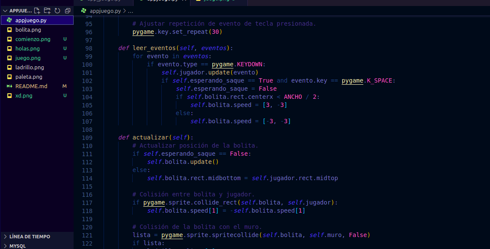
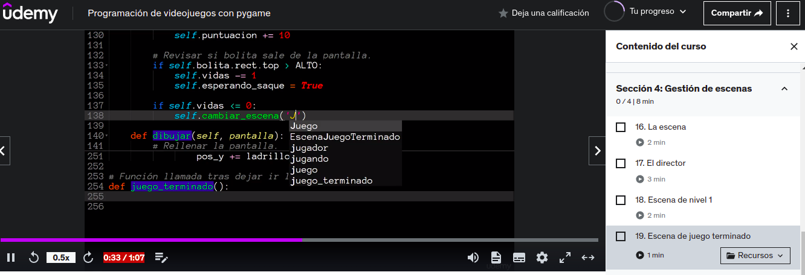
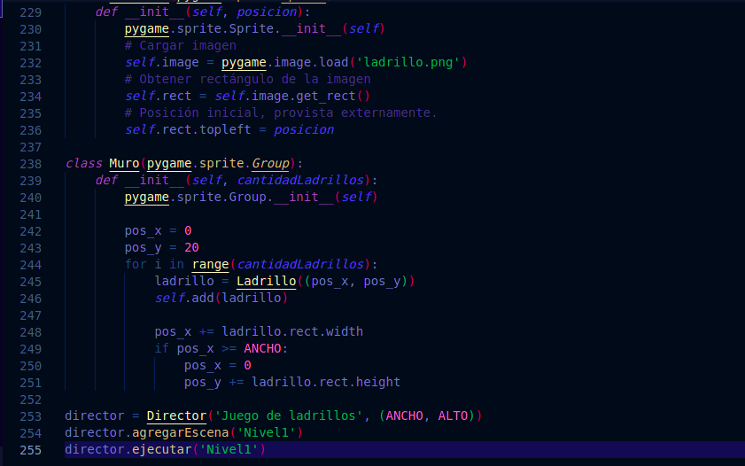
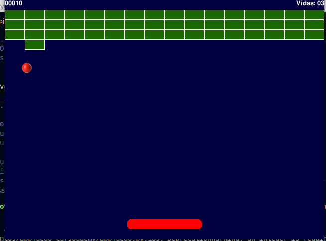

### PRINCIPIOS DEL JUEGO
## Comenzamos viendo unos videos donde nos explica paso por paso el juego que vamos a hacer 

### OTRA FOTO DE COMO ESTABAMOS COMENZANDO

### MÁS ADELANTE DEL VIDEO DE EL JUEGO

### TERMINACIÓN DEL JUEGO
## DONDE ESTAMOS HACIENDO LAS ULTIMOS ARREGLOS PARA QUE EL JUEGO FUNCIONE.

### Al final terminamos el juego gracias a los videos que vimos y el juego era de una pelotica que iba rebotando para romper unos bloques mientras golpeaba con tabla y no podías dejarla caer por que perdías vida, solo tienes 3 vidas y si pierdes las 3 vidas el juego se acaba esa es la función del juego.

